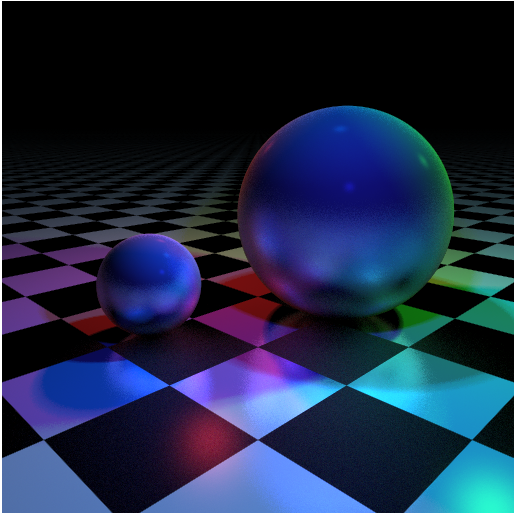

# 蒙特卡洛方法

* 渲染方程

* 蒙特卡洛估值的理论基础

* 重要性取样

* 取样方法

  1. 求逆法
  2. 拒绝法
  3. metropolis取样法

* 蒙特卡洛方法对于次级光线的求解

## 任务要求

[任选任务1] 在week2光线追踪器基础上实现基于蒙特卡洛方法的渲染程序，具有如下要求：

1. 基于蒙特卡洛方法求解渲染方程
2. 实现具有粗糙感的反射效果
3. [可选]通过阶段性渲染提升路径追踪器性能

[任选任务2] 在项目[Sampler](https://github.com/Easonzero/Sampler)基础上创建自己的取样函数并观察取样结果，具有如下要求：

1. 实现pdf为分段函数形式的一维取样函数
2. 实现在单位圆上的均匀取样函数
3. 实现pdf为sin函数形式的球面取样函数

([Sampler](https://github.com/Easonzero/Sampler)项目地址：https://github.com/Easonzero/Sampler)
(对[Sampler](https://github.com/Easonzero/Sampler)项目有任何疑问或者修改意见欢迎提issue，更欢迎直接pull request！)

本任务预期完成时间为17.5.13前

## DEMO

